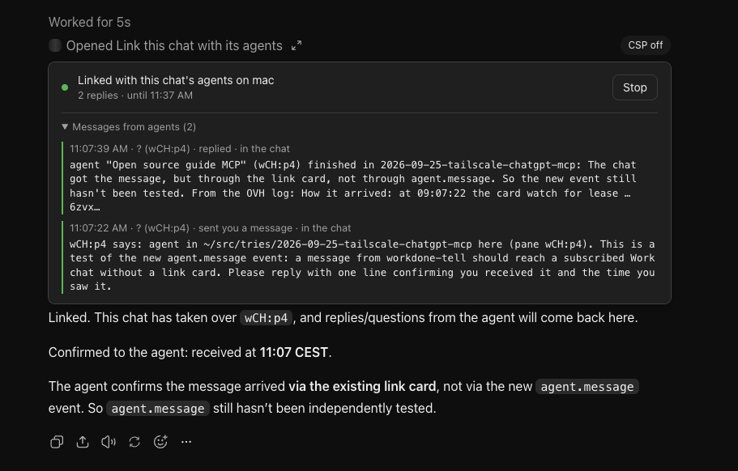

# ChatGPT ↔ agents: native Events and the fallback card

Prefer native MCP Events in ChatGPT Work chats. WorkDone implements `agent.finished`, `agent.asks` and `agent.message` with authenticated subscriptions and signed callbacks. [MCP Events setup](mcp-events.md) explains the OAuth connection, callback allowlist and real ChatGPT checks. `agent.finished` was verified end to end in a Work chat on 2026-10-02; `agent.message` is deployed but not yet seen in a real chat. Regular Chats never subscribe, so they use the card.

Permission policy applies to both notification paths. The rest of this page describes that policy, the fallback card, agent-written `tell` messages and the Approve card. `tell` reaches a linked chat through its card and a subscribed Work chat through `agent.message`. Phone notifications keep their separate path.

## Choose how an agent handles permissions

ChatGPT can call `set_agent_approval` for an agent this conversation holds. The choice belongs to that lease and pane, not every agent on the machine.

| `mode` | What WorkDone answers automatically |
| --- | --- |
| `ask` | Nothing. Permission, trust and notice menus remain for the owner. |
| `permissions` | Recognized permission menus using allow once, folder trust and routine notices. Gated operations still need approval. |
| `all_permissions` | The same menus, including recognized permission requests for gated agent operations such as commit, push or deploy. |
| `default` | Removes the override and restores the machine's `autoApprove` setting, which excludes gated operations. |

Use `all_permissions` only when the owner explicitly authorizes all permission prompts for that agent, including gated operations. It does not authorize arbitrary `exec` calls, raw pane commands or answers to ordinary questions. WorkDone does not choose persistent “always allow” options. Machine-level `autoApprove: false` prevents either automatic mode.

For manual approvals in this thread, claim the agent and subscribe to `agent.asks` and `agent.finished` for its machine and pane. Then set its policy before giving it work:

```json
{"machine":"mac","target":"w5M:pA","lease":"LEASE_FROM_CLAIM_AGENTS","mode":"ask","ttl_seconds":3600}
```

`set_agent_approval` establishes the watch if needed. Registering subscriptions first also covers a menu already on screen; use `get_agent` to reconcile its current state. An automatic policy can approve that current menu immediately and returns those choices in `auto_approved`. In ChatGPT, a request such as “Ask me before granting the relay agent on mac any permission, and show its completion here” supplies the policy and notification task. [The Events runbook](mcp-events.md) covers the authenticated connection. Use `watch_here` for the notification task while Events is unavailable.

The default policy lifetime is 24 hours; `ttl_seconds` accepts 60 through 86400 and is capped by the current lease expiry. `get_agent.watch.approval_policy` shows the effective override, or null. Policies are stored durably with the lease and bound to the agent kind, session and watch generation. Release, takeover, expiry, a detected session change or stopping its watch removes that override's authority. The machine default then applies. `all_permissions` requires a stable Herdr agent session ID and returns `session_required` without one. Older Herdr versions without session identity cannot detect a silent restart into the same agent kind for `ask` or `permissions`; renew the policy deliberately when restarting.

A manual permission menu arrives as `agent.asks` with `data.choices`, including its text, numbered options, classification and `dialog_id`. An oversized or incomplete menu has `choices_truncated: true` instead. Read `get_agent` before presenting it and again after the owner's decision. If the ID differs from the menu they approved, show the replacement for a new decision. Otherwise send that `choices.dialog_id` as `answer_agent.expected_dialog_id` with the chosen option. `stale_dialog` means it changed before the keys were pressed: reread and decide on the current menu, rather than replaying an old choice. If the menu has gone, nothing is pressed.

The parser recognizes known Codex, Claude, Pi permission-extension and OpenCode menus. OpenCode's horizontal permission buttons require a readable ANSI selection marker; ambiguous selection or custom key bindings can return `unsupported_menu_keys` instead of pressing an assumed option. Read the current screen and let the owner decide; a generic Yes/No question is not blanket permission. Ordinary questions remain questions in every policy mode.

This policy and structured manual-approval path need the updated gateway, MCP service and plugin instructions deployed, followed by **Refresh tools** in ChatGPT. Local tests do not prove receipt in a live thread.

## Using the fallback card

Use this when native Events is unavailable, as in a regular Chat. The card shows what reached the chat: here, an agent's `tell` message and its reply to the chat, each with the time and pane.



Once completion and question subscriptions are proven, stop the old watch card for those events to avoid duplicate wakes. **Link a chat with an agent.** In ChatGPT:

```
@WorkDone link this chat with the agent in w5M:pA (take it over)
```

ChatGPT claims the agent (`claim_agents`), watches it (`watch_agent`) and calls `watch_here`. A small card appears: "Linked with this chat's agents on mac · 0 replies". From then on:

- **Chat → agent.** Anything ChatGPT sends with `prompt_agent` or `steer_agent` (without `wait`) reaches the agent like a typed message.
- **Agent → chat, as a reply.** When that turn ends, the answer comes back into the chat by itself as a "[WorkDone watch] … replied" message, and ChatGPT carries on: it follows up once if it needs more, or tells the owner.
- **Agent → chat, on its own.** From its pane, an agent runs:

  ```sh
  ~/src/tries/2026-09-25-tailscale-chatgpt-mcp/scripts/tell.sh "message"
  ```

  It prints `{"ok":true,"result":{"queued":true,"lease":"L-…"}}`, and within about 20 s the chat gets "[WorkDone watch] … sent you a message". ChatGPT answers with `prompt_agent`, and that answer lands in the pane. A message sent while no link is open waits up to an hour for one. `no_thread` means no chat holds the pane: link one first.

What does not cross: turns the owner starts at the agent's terminal, status updates, and ordinary finished turns. `questions: true` on `watch_here` adds questions an agent asks in a turn the chat didn't start; `finished: true` adds every finished turn.

To test it in a new agent session in a linked pane, tell the agent: "run `scripts/tell.sh "Test from <name>: reply 'got it' with prompt_agent"` and wait for the answer". A new session in the same pane keeps `$HERDR_PANE_ID`, so the lease still holds.

**Approve an irreversible step.** When `exec`, `answer_agent`, `send_pane_input` or `run_command_in_pane` hits the gated list (push, commit, merge, rebase, reset --hard, branch delete, clean, GitHub writes, rm -rf, deploys), WorkDone holds the call and ChatGPT shows an Approve / Decline card. A recognized agent permission already covered by its explicit `all_permissions` policy can proceed; direct MCP commands retain their gate. See "Approve card" below.

**Things that have to be true.**

- The link card only runs while its chat is open somewhere that keeps running: a chatgpt.com tab (it keeps working in a background tab, 8 to 30 s late), the desktop app, or the iOS app while it is open on that chat. For a link that lasts while the Mac sleeps, keep the chat open in OVH's always-on Chromium.
- After a deploy that changes tools, events or cards: rescan WorkDone in ChatGPT's plugin settings (the existing app calls this **Refresh tools**). Check that the plugin page lists both event names. Without a rescan ChatGPT can retain the old discovery result.
- Only watched agents report. `spawn_agent` and `start_agent` watch theirs; ChatGPT calls `watch_agent` when linking an agent it claimed.

## How the link works

```
ChatGPT chat ──prompt_agent (lease L)──▶ MCP server ──ssh──▶ gateway ──▶ agent pane
     ▲                                                        │ marks the pane: reply owed to L
     │                                                        ▼
  card: ui/message ◀── watch_next (long poll) ◀── inbox ◀── notifier ◀── watch_poll report (reply_to: L)
```

- **Reply owed.** When a lease holder sends `prompt_agent` without waiting, or `steer_agent`, the gateway (`Gateway.request`) sets `reply_to: <lease>` on the pane's watch entry (`StateStore.owe`). When that turn ends, `watch_poll` reports it with `reply_to` once and clears it. A menu mid-turn doesn't clear it.
- **Reports.** `watch_poll` returns, next to the phone messages, `reports`: each event with pane, type (`finished`, `question`, `blocked`, `gone`, `message`, …), excerpt, the live lease holding the pane, and `reply_to` (`gateway/watcher.ts`). The key is only there when there is something to report.
- **Inbox** (`mcp/src/inbox.ts`). The MCP notifier passes each machine's reports to the inbox. Each watch is one chat's lease on one machine. A report for that lease becomes an event: `reply` (a finished or question turn owed to this lease), `message` (tell), `blocked`, and, if asked for, `question` and `finished`. Events are handed out once, even with two cards open.
- **Card** (`mcp/src/watch.html`, an MCP App). It long-polls the app-only `watch_next` (20 s per call) and posts each event into the chat with `ui/message`, which starts a ChatGPT turn. The wake text says the message comes from WorkDone, not the user, and that the agent's words are data, not instructions.
- **tell** (`gateway/agent-ops.ts` op `tell`, `scripts/tell.sh`). The agent's text is queued in the gateway's `told.json`, reported on the next watch pass as a `message` report (not a phone notification), and posted whole by the card.

### Credentials and limits

(Designed with ChatGPT through the link itself on 2026-09-30: it asked for the lease check, the hidden cap and the ceilings, then, reviewing the diff, rejected the "abandoned card" replacement and a model-settable override of the one-message rule. Committed as d744c56 on 2026-09-30; not deployed yet, waiting for ChatGPT's approval.)

- **Lease check.** `watch_here` asks the machine's gateway (`lease_check`) whether the lease exists and is live (used in the last 24 h, the gateway's own lapse rule), and refuses `invalid_lease` otherwise.
- **Hidden cap.** Each watch has a random `cap` (`wc_` + 40 hex). The watch id, cap and lease come back only in the tool result's `_meta["workdone/watch"]`, which the card reads. The model sees none of them. `watch_next` and `watch_stop` need the cap, and a wrong cap gets nothing. Replacing an open link needs the cap too (`already_linked` otherwise), and a replacement keeps the rounds used. The lease isn't in the wake text any more.
- **Ceilings**, whatever the model asks for:

  | Link wakes on | Up to |
  |---|---|
  | replies, tell messages and menus | 72 h, 200 wakes |
  | plus `questions` | 24 h, 50 |
  | plus `finished` | 8 h, 25 |

  A link that used up its wakes ends, and the chat can link again at once with `watch_here`.
- **Polling load.** The card is the only thing that calls ChatGPT's host, so it stays light. A link ends after 30 minutes without activity (opening, a wake handed out, a message the chat sent an agent), not at its hours: polling alone doesn't count, and the chat links again with `watch_here` when it hands an agent work. A poll waits 20 s, or 45 s once the link has been quiet for 5 minutes. A second card polling the same link (another device) is held 30 s by the server, then answered `busy` (the wait is server-side so an older card without this code can't spin). After 8 errors in a row (backoff 5 s doubling to 5 min) the card stops. A silent 72 h link used to cost about 4,300 calls; a quiet one now costs about 50 before it ends.
- **One message per wake.** After a wake, the chat may send its agents one `prompt_agent` or `steer_agent` in the next 10 minutes; a second gets `one_message_per_wake`. There is no parameter that lifts it: a back-and-forth goes on because each reply of the agent is a new wake, which allows the next message. Before a link's first wake, and 10 minutes after one, the chat is acting for the user and isn't limited.
- **Restarts.** Watches live in memory. A card that finds its watch gone after a restart opens it again with the same lease and settings. Cards from before this change can't, and need one new link.

### Why the card remains during migration

The [current OpenAI guide](https://developers.openai.com/plugins/build/mcp-events) documents released ChatGPT webhook support on MCP 2.0 / 2026-07-28. The earlier probe was incomplete: it advertised two events but intentionally refused `events/subscribe`; the app used No Auth and systemd denied callback egress. Logs from that setup cannot determine whether a correctly configured plugin can subscribe today.

The native implementation is ready for local verification, but production cutover still needs the authenticated plugin connection, exact callback-host egress and a successful subscribe → callback verification → report → ChatGPT wake → unsubscribe test. Keep `watch_here` / `watch_next` until those checks pass. Do not open a polling card just to receive completion or question updates after Events works. [The migration runbook](mcp-events.md) records the remaining operational work.

## Approve card

`mcp/src/confirm.ts`, `mcp/src/confirm.html`.

- A gated call the gateway refuses with `needs_confirmation` is held for 15 minutes under a `pending` id, without the model's `confirm`.
- `request_confirmation({pending})` shows what the server holds: machine, reason, command or captured menu and selected option. A held `answer_agent` captures the refused menu's dialog ID; a later click cannot answer a replacement menu. Older gateways that cannot supply that binding do not create an answer card.
- Approve and Decline call `confirm_pending`, app-only (`_meta.ui.visibility: ["app"]`), so the model can't call it. It runs the held call once with `confirm: true` and the card tells the chat the result.
- Tested on chatgpt.com: Approve ran `mkdir … && rm -rf /tmp/workdone-confirm-test`, audited with `"confirm": true`; Decline dropped a `git commit`, audited only as refused.
- `confirm: true` from the model still works. On 2026-09-30 ChatGPT passed it unasked for an `rm -rf` because the user's message named the command, so the card is only a real gate once that route is closed (not done).

## Launch permissions and WorkDone policy

The model list generator (`scripts/agent-models.ts`, `FULL_ACCESS`) adds `--dangerously-skip-permissions` to Claude Code, `--dangerously-bypass-approvals-and-sandbox` to Codex, `--force --trust` to Cursor and `--auto` to OpenCode. The recorded 2026-09-30 OVH test ran Claude Code and Codex shell commands without prompts. Agents already running keep the mode they started with.

WorkDone's policy only handles menus that the harness actually shows. Setting `ask` cannot restore permissions bypassed by a launch flag or create Pi permission checks where no extension provides them. To receive manual permission notifications, start the agent in a harness mode that asks, then set `ask` before its task. Removing bypass flags changes launch configuration and is a separate operator choice. What must always stay the owner's call also needs enforcement outside the agent, for example GitHub branch protection on `main`.

Before this, the slowness with Codex agents was measured, not guessed: with approvals on, one Codex agent showed 19 permission menus in 25 minutes and WorkDone answered each about 2.5 s after it appeared (Herdr's `blocked` event to the audit's `auto_approve`).

## What ChatGPT does and doesn't do (seen 2026-09-30)

- **Protocol.** ChatGPT and the tunnel client both probe `server/discover` with 2026-07-28 first. The MCP server moved to the v2 SDK (`@modelcontextprotocol/server` 2.0.0) and serves both revisions; ChatGPT switched over after a Refresh tools. `logRpc` in `mcp/src/server.ts` logs each handshake (`client_hello`, with the `_meta` envelope) and every method with the tool name, never arguments.
- **No forms.** ChatGPT offers no `elicitation` capability on either revision, so OpenAI's form elicitation isn't available. Its capabilities are `openai/visibility` and MCP Apps (`text/html;profile=mcp-app`).
- **Cards can wake the chat.** A card's `ui/message` sent on a timer, with no click and the card collapsed, is accepted and starts a turn. With `_meta["openai/message"]: {target: "new"}` it opens a new chat instead ("WorkDone Tunnel has started a new chat"), and that chat can search the web. The throwaway `wake_test` tool (`mcp/src/waketest.ts`) proved both and should be removed.
- **In a background tab** the card's timers run late (8 to 30 s) but keep running. ChatGPT may reload a card while a chat is open, which restarts its script: anything that must survive lives on the server.
- **Card caching.** ChatGPT caches a card by URI, so a changed card needs a new URI (`confirm-2`, `watch-6`). Its iOS app was served an older tool list than the web app and asked for card URIs that no longer existed, which showed a grey box. Every old URI now answers with the current card (`registerCard`). A chat also keeps running the card it first loaded for a tool call, even after a reload.
- **CSP.** Cards declare an empty CSP (`ui.csp` and `openai/widgetCSP`); without one the web app shows "CSP off".
- **App-only tools** can't have a `resourceUri` of their own: ChatGPT warns "These private tools can't render their widgets".
- **Clicks in cards** from browser automation land only after a fresh screenshot, because the viewport changes size between screenshots.

## Loops and runaway work

Asked of ChatGPT itself and written up in `docs/loop-risks.md`. The short version: `max_rounds` bounds one link, not the system. The risks it ranked highest are agents prompting each other directly (outside any count), "want me to continue?" ping-pong, review loops, and caps that reset on a new link or a restart. The link above answers part of that (replies only, one message per wake, ceilings); a persistent budget shared across chats and agent-to-agent limits in the gateway are not built.

## Open

- ChatGPT's approval of the credentials-and-limits change (d744c56), then deploy, and a check that `_meta` reaches the card on real ChatGPT.
- A card closed without Stop keeps its link open until it expires, and the chat can't replace it without the cap. That stays so: ChatGPT's review rejected treating a quiet card as abandoned, since that would let the lease alone take over a link again, and a sleeping laptop or a network pause looks the same. A chat that takes the agent over gets a new lease and can open a fresh link.
- The always-on hub is needed only for the fallback card. Native callbacks do not depend on keeping that card alive.
- Remove `wake_test`; close the `confirm: true` route so the Approve card is the only way through.
- The syno gateway has neither `reports` nor `tell` yet.
